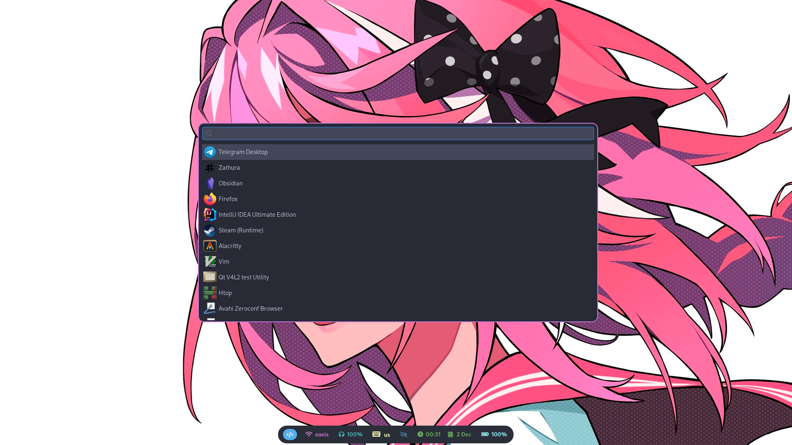
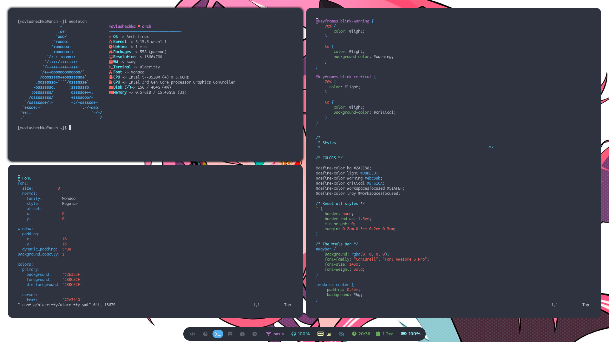
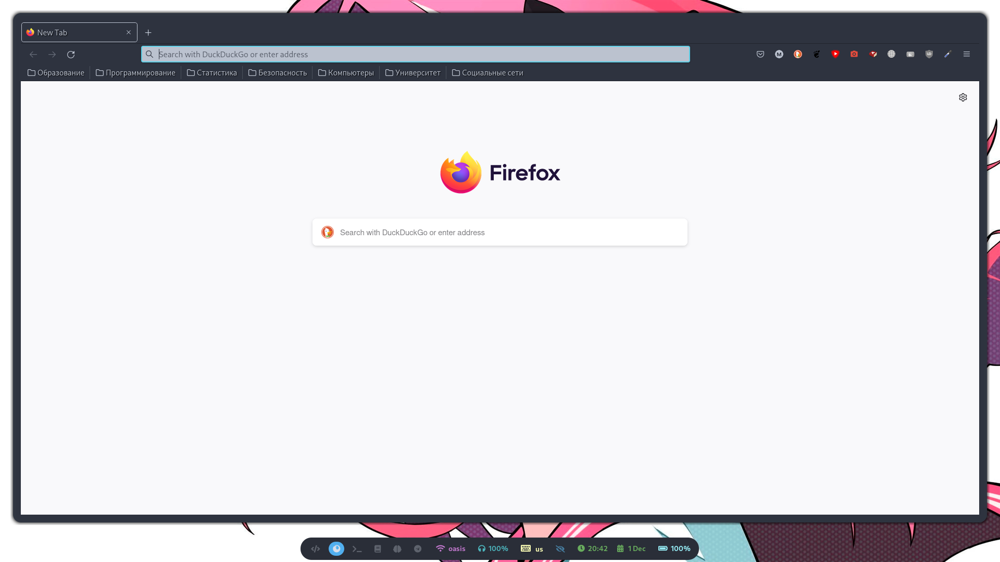
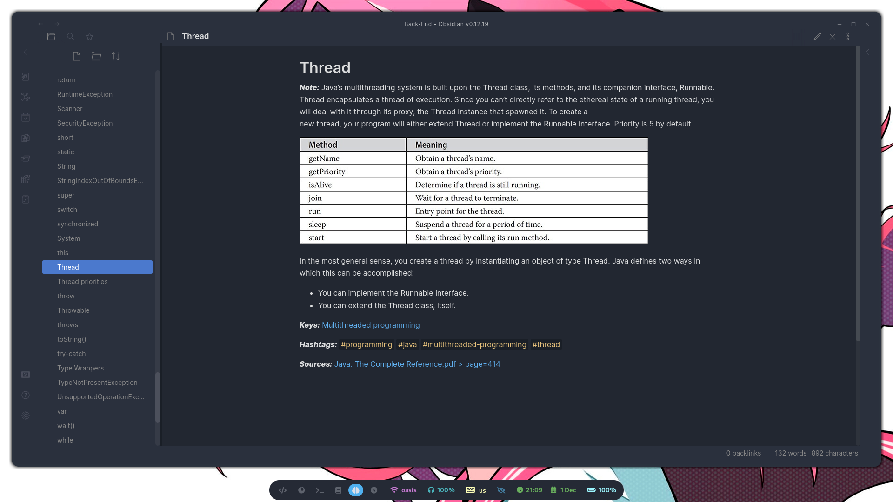
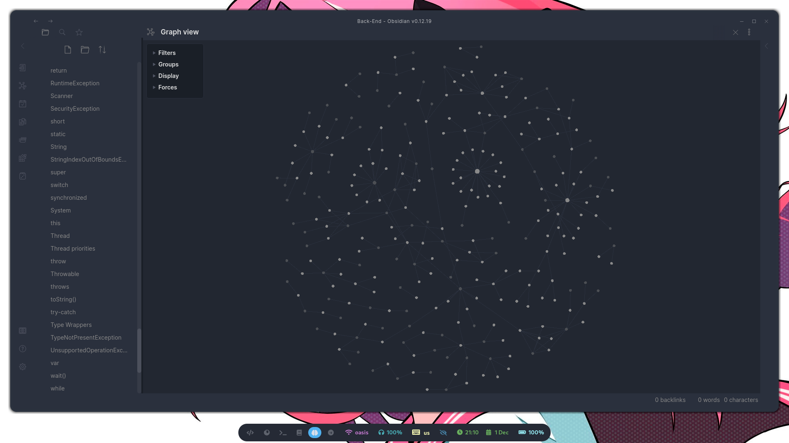

# dotfiles
Personal dotfiles.

## Programs
- Distro: Arch Linux
- Theme: Doom-vibrant
- Window Manager: Sway (sway-borders)
- Bar: Waybar
- Lock: Swaylock (swaylock-effects)
- Terminal: Alacritty
- Font: Monaco
- Runner: Wofi
- Text editor: Vim
- Browser: Firefox (theme: [doom-vibrant](https://addons.mozilla.org/en-US/firefox/addon/doom-vibrant/))
- Fetch: Neofetch

## Screenshots

